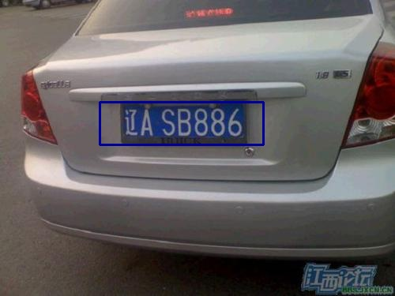

# license-plate-recognition
> 车牌识别

## 获得镜像
1. 拉取Docker Hub上的license-plate-recognition镜像
```bash
$ sudo docker pull gouchicao/license-plate-recognition:latest
```

2. 自己构建license-plate-recognition镜像
```bash
$ sudo docker build -t gouchicao/license-plate-recognition:latest .
```

## 运行车牌识别预测服务
```bash
$ sudo docker run -it -p 5000:5000 license-plate-recognition:latest
```

## 测试车牌识别
* Python测试代码
```py
import os
import requests


API_URL = 'http://localhost:5000/license-plate-recognition/api/v1.0/'


def detect(filename):
    files = {'file': (filename, open(filename, 'rb'), 'image/png', {})}
    response = requests.post(API_URL + "detect", files=files)
    return response.json()

if __name__ == '__main__':
    json = detect('images/2.jpg')
    print('response json>\n', json)
```

* curl测试
```bash
$ curl -v -X POST -H "Content-Type: multipart/form-data" -F "file=@test.jpg" http://127.0.0.1:5000/license-plate-recognition/api/v1.0/detect
```

## 测试效果
* 返回的结果
```json
[
    {
        "rectangle": {
            "x": 126,
            "y": 129,
            "w": 207,
            "h": 54
        },
        "object": "辽ASB886",
        "confidence": 0.9705592223576137
    }
]
```


